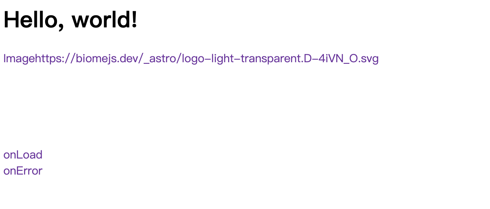
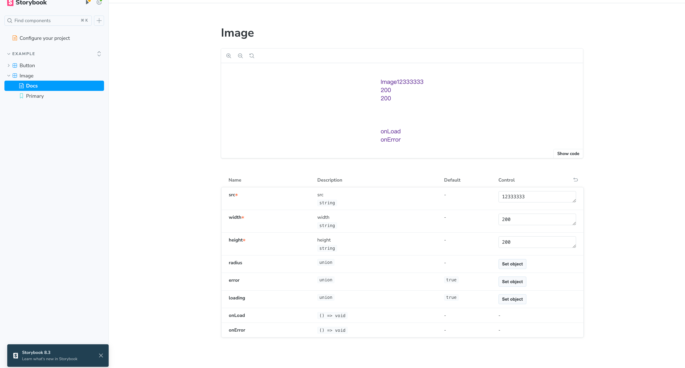

# Bedrock

# react-component-library-template

This is a template to create a react component libraries with Vite

## Features
- React
- TypeScript
- Biome & Stylelint
- Storybook
- Vite
- Vitest
- Husky
- Commitizen

## Scripts

- "format": format the code
- "build": build the components
- "bump": bump a patch version
- "push:main": push history and tags
- "dev:demo": run the demo

- "dev:demo-dist": run the demo-dist
- "storybook": run the storybook

- "test:ui": run the vitest

``` json
{
  "tasks": {
    "lint": {
      "dependsOn": ["^build"]
    },
    "format": {
      "dependsOn": ["^format"],
      "cache": false
    },
    "build": {
      "dependsOn": ["^build"],
      "outputs": ["dist/**"]
    },
    "test": {
      "dependsOn": ["^test"]
    },
    "test:watch": {
      "cache": false,
      "persistent": true
    },
    "test:coverage": {
      "dependsOn": ["^test"],
      "outputs": ["coverage/**"]
    },
    "benchmark": {
      "dependsOn": ["esbench#benchmark"],
      "cache": false
    }
  }
}
```

## Will change structure to this
- global tsconfig
  - path to packagages
  - packages has components, structs, etc
  - path will be as follows:
    - components (parent dir)
      - README.md, pkg.json, tsconfigs
      - test, src, scripts
      - src
        - CmpName
          - CmpName.d.ts, CmpName.js, CmpName.spec, etc...
          - index.d.ts, index.js
      - index.d.ts (barrel), index.js (barrel), index.test.js

``` jsx
// CmpName.tsx
const CmpName = React.forwardRef()?
...
export default CmpName
```
And then in index.d.ts
``` js
export { default } from CmpName;
export * from './CmpName';

export { default as cmpNameClasses } from "./classes'
export * from './classes';kkk
```

Barrel file is structured as follows:
``` js
export { default as Accordion } from './Accordion';
export * from './Accordion';

export { default as AccordionActions } from './AccordionActions';
export * from './AccordionActions';
```

## Components to Create List
- Accordion
- Alert
- Breadcrumb
- Button
- Calendar
- Drawer
- Input
- Navigation
- Progress
- Select
- Sidebar
- Skeleton
- Toast
- Tabs
- TextArea
- Typography

- Dark mode

- Themeing

### Blocks (alternative to stories?)